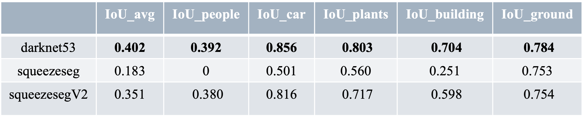

# rangenet-POSS
3D Lidar segmentation on PKU POSS dataset using rangenet++ model

_Examples of segmentation results from [PKU POSS](http://www.poss.pku.edu.cn/download.html) dataset:_

## Dataset

Download the data set from here:
http://www.poss.pku.edu.cn/download.html
Dataset for semantic segmentation of 3d lidar data in dynamic scene using semi-supervised learning(2019 Mei T-ITS)(2.16GB)

Then put it in your root directory.

## Environment

RTX 2080Ti(11G), Cuda 10.1, torch 1.7.1, torchvision 0.8.2

## Description

This code provides code to train and deploy Semantic Segmentation of LiDAR scans, using range images as intermediate representation. 

## Scripts

cd rangenet-POSS/poss_rangenet/lidar-bonnetal/train/tasks/semantic

To train:
 ./train.py -d /root/dataset -ac /root/cfgs/darknet53.yaml -dc /root/cfgs/data_cfg.yaml -l /root/train_log_darknet53

To evaluate:
./evaluate_iou.py -d /root/dataset -p /root/pred_dartnet53 --split test -dc /root/train_log_darknet53/data_cfg.yaml

To infer:
./infer.py -d /root/dataset -l /root/pred_squeezeseg -m /root/train_log_squeezeseg

To visualize:
./visualize.py -d /root/dataset -p /root/pred_dartnet53 -s 00

## Result

